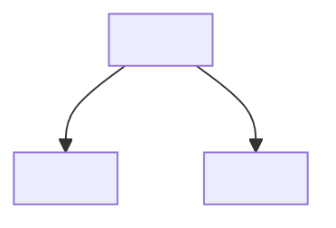

# Design audit — reference report template

Used by **`.cursor/skills/audit-design/SKILL.md`**. Write for a **scientist or PM** first; link paths for implementers.

---

## Report body (`tasks/design-audits/…` or chat)

```markdown
# Design audit — <short title>

**Top-level design:** `<path/to/README.md>`
**Date:** YYYY-MM-DD
**Verdict:** Ready | Caution | Blocked

## Plain-English summary

2–4 sentences: what this design area is for, whether we can ticket it now, and the single biggest risk.

## Doc map



Or a short bullet list if Mermaid is not helpful.

## Fix before tickets

Items that would force implementation guesses (**DESIGN-GAP**, **DESIGN-FLAW**, unresolved blocking questions).

| Item | Where | Plain English | Action |
| --- | --- | --- | --- |
| … | `path` | … | Amend design / answer question |

*If none:* “None identified.”

## Address (before or during first tickets)

Known divergence, missing test hooks, or **REWORK-REQUIRED** — design is target; work is planned.

| Item | Where | Plain English | Action |
| --- | --- | --- | --- |
| … | … | … | Rework / ticket with explicit acceptance |

## Defer / ignore for v0

**GROWTH**, **REFINEMENT**, or explicit out-of-scope — safe to defer if trigger/limit is documented.

| Item | Trigger or reason | Upgrade or follow-up |
| --- | --- | --- |
| … | … | … |

## Component readiness

| Component | Ready? | Notes |
| --- | --- | --- |
| … | Ready / Needs design / Unknown | … |

## Code vs design (if applicable)

Short bullets only when shipped or stubbed code exists.

## Ticket DAG sketch (illustrative)

Optional Mermaid — **not** canonical; **`/feature-request`** owns the real DAG.

## Open questions for humans

Numbered list; owner optional.

---

### Executive summary

- …

### Suggested next step

…

### Options *(if applicable)*

- **A.** …
- **B.** …
```

---

## Verdict rubric (quick reference)

| Verdict | Typical state |
| --- | --- |
| **Blocked** | Any unresolved **Fix before tickets** row |
| **Caution** | Only **Address** / **Defer** rows; human accepts risk |
| **Ready** | No blockers; deferrals documented |
