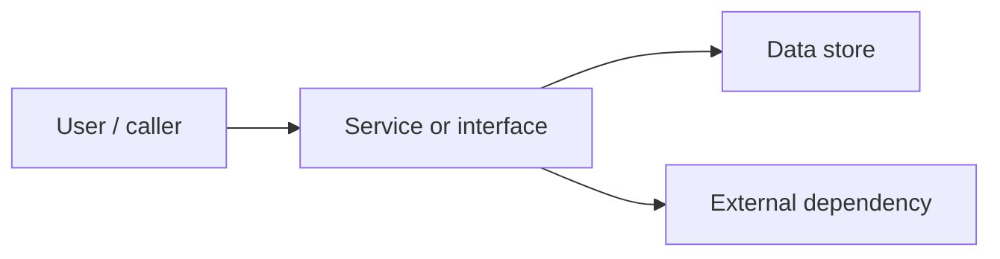

# Security audit - reference report template

Used by **`.cursor/skills/audit-security/SKILL.md`**. Write for an engineering lead, security reviewer, and implementer: direct, evidence-based, and explicit about unknowns.

---

## Report body (`tasks/security-audits/...` or chat)

```markdown
# Security audit - <short title>

**Target:** `<path/service/protocol/image/dependency set>`
**Date:** YYYY-MM-DD
**Branch / commit:** `<branch or commit, if applicable>`
**Verdict:** Ready | Caution | Blocked | Critical
**CVE/advisory currency:** Complete | Partial | Unknown

## Plain-English summary

2-4 sentences: what was reviewed, the security posture, and the single biggest risk or uncertainty.

## Scope and evidence

| Item | Evidence |
| --- | --- |
| In scope | `paths`, services, protocols, package manifests, images |
| Out of scope | ... |
| Languages/runtimes | ... |
| Protocols/interfaces | ... |
| Dependency evidence | lockfiles, SBOMs, image digests, package manifests |
| Commands run | read-only commands with timestamps |
| Advisory sources | NVD, OSV, GHSA, CISA KEV, vendor advisories, EPSS if used |

## Architecture and trust boundaries

Short bullets or Mermaid diagram showing assets, entry points, and trust boundaries.



## Stop-ship / fix first

Critical or High issues that block release, deployment, ticketing, or implementation.

| Severity | Finding | Evidence | Impact | Required action |
| --- | --- | --- | --- | --- |
| Critical/High | ... | `path:line`, CVE/GHSA/OSV, config | ... | ... |

*If none:* "None identified from available evidence."

## CVEs and advisories

| Component | Version evidence | Source | Result | Priority | Notes |
| --- | --- | --- | --- | --- | --- |
| package/image/runtime | lockfile line, CPE, digest | NVD/OSV/GHSA/KEV/vendor | Affected / Not affected / Unknown | Critical/High/Medium/Low | Fix version, KEV/EPSS, reachability |

Include source URLs or command names and retrieval timestamps. If lookup was incomplete, explain why.

## Language and protocol checklist

| Area | Status | Notes |
| --- | --- | --- |
| Authn/authz | Pass / Finding / Unknown / N/A | ... |
| Input validation / injection | ... | ... |
| Data protection / privacy | ... | ... |
| Protocol security | ... | ... |
| Supply chain | ... | ... |
| Operations / logging | ... | ... |
| Language-specific probes | ... | ... |

## Findings

### <Severity> - <finding title>

**Affected component:** ...
**Evidence:** ...
**Impact:** ...
**Exploitability context:** ...
**Remediation:** ...
**Verification:** ...
**Residual risk:** ...

Repeat for each finding, ordered by severity.

## Accepted / deferred risks

| Risk | Reason accepted | Trigger to revisit | Owner |
| --- | --- | --- | --- |
| ... | ... | ... | ... |

## Unknowns and incomplete checks

Items that could change the verdict: missing lockfiles, no image digest, unavailable scanner, blocked network lookup, ambiguous ownership, absent design, unavailable live config.

## Recommended verification

Commands, tests, manual checks, or follow-up audits that would prove remediation.

---

### Executive summary

- Verdict: ...
- Top risks: ...
- CVE/advisory status: ...

### Suggested next step

...

### Options *(if applicable)*

- **A.** ...
- **B.** ...
```

---

## Verdict rubric (quick reference)

| Verdict | Typical state |
| --- | --- |
| **Critical** | Confirmed exposed secret/data, reachable KEV/critical CVE, auth bypass, RCE, or active exploitation risk |
| **Blocked** | High risk or missing evidence prevents safe implementation/release decisions |
| **Caution** | Incomplete evidence or Medium/Low findings remain with explicit follow-up |
| **Ready** | No Critical/High findings; current advisory checks completed for known versions |
