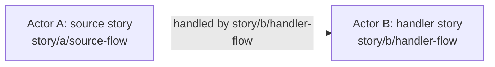
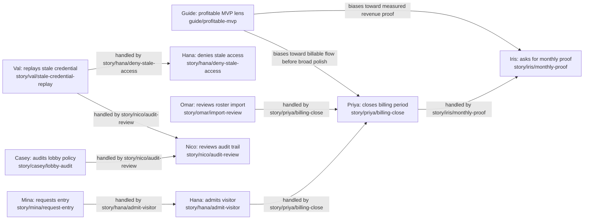

# Actor-driven development

Actor-driven development turns seeded users, personas, stakeholders, antagonists, guiding figures, and other forces into traceable actors whose stories can be followed from daily life to design docs, tickets, tests, UI, backend behavior, persistence, schedules, and growth ideas.

The goal is not to write decorative personas. The goal is to create an executable product map: if an actor appears in seed data, demos, screenshots, tests, E2E flows, or product decisions, the repo should explain who they are, what they are trying to do, what time or persistence means in their life, what system surfaces they exercise, and how their story affects other actors.

## Theory

An actor is any force that changes product behavior. Actors include:

- Direct users with roles, accounts, permissions, sessions, and UI journeys.
- Seeded personas and fixture rows used by tests, demos, screenshots, onboarding, or support.
- Stakeholders who do not log in but apply pressure: investors, auditors, operators, managers, regulators, partners, vendors, and support teams.
- Antagonists and failure forces: fraud attempts, confused users, abusive users, stale data, outage conditions, compliance constraints, and economic pressure.
- Guiding figures: named principle-carriers who bias decisions across actors and alternatives without necessarily appearing in the product. A military planning tool might use John Boyd as a guiding figure for OODA-loop tempo, or Jocko Willink as a guiding figure for extreme-ownership habits. A business tool might use a VC/investor archetype to bias decisions toward profitable MVP proof instead of broad feature completion.

Each actor owns story keys:

```text
story/<actor-slug>/<flow-slug>
```

A story key names a testable slice of life. It should describe a trigger, expected flow, UI surface, backend/API/domain surface, time or persistence behavior, security boundary, and test duty.

Stories are connected by edges. One actor's story often creates work, risk, value, or evidence for another actor. The edge must name a handler story on the affected actor. If no handler story exists, the profile set has a coverage hole: add the missing story, allocate a new role/persona if needed, and link it into the graph before the feature reaches VAL.

Actor dreams are the growth loop. A dream starts from a profile and asks: "What would make this actor's fictional life easier while respecting current product rules and safety boundaries?" Dreams can become tests, refinements, design gaps, rework candidates, or formal growth candidates. They are not implementation permission by themselves.

Guiding figures are not celebrity decoration. They should provide decision bias:

| Field | Meaning |
|-------|---------|
| Figure | Person, archetype, doctrine, or school of thought |
| Principle lens | The core concept the figure contributes |
| Decision bias | How this lens chooses among alternatives |
| Affected actors | Which roled users, stakeholders, antagonists, or processes this lens influences |
| Story pressure | Which story edges or missing handlers the lens highlights |
| Guardrail | Where the lens should not override product safety, evidence, ethics, or local design authority |

## Practice

1. Inventory user-like seed sources: backend seed rows, frontend fixtures, demo accounts, role fixtures, E2E personas, import rows, test-only accounts, and future persistent seed commands.
2. Add non-user forces: stakeholders, antagonists, vendors, regulators, investors, policy constraints, abuse patterns, guiding figures, and operational pressure.
3. Create one actor profile per meaningful actor or force.
4. Give each profile stable story keys, time/persistence behavior, security boundaries, and test duties.
5. Build a story graph. Every cross-actor effect needs an edge and a handler story.
6. Run actor-dream passes to discover missing handlers, missing roles, missing test coverage, and future growth candidates.
7. Wire validation so new seeded actors and required story metadata fail tests before VAL when profiles are missing.
8. Trace story keys into design docs, tickets, unit tests, integration tests, E2E tests, and growth candidates.

## App-Readable Corpus

Narrative Markdown is the human source of meaning, but applications and agents need stable graph data. Repos should maintain a parseable actor graph under a single root such as `docs/design/actors/`:

| Path | Purpose |
|------|---------|
| `actors/*.md` | One actor profile per file, with frontmatter for `id`, `kind`, `title`, `roles`, `status`, seed anchors, and story ids. |
| `stories/*.md` | One story per actor/action slice, with frontmatter for `id`, `actor_id`, `action_id`, `availability`, route/test metadata, and stable story key. |
| `edges.jsonl` | Typed story relations. Machines trust these IDs over free-text links. |
| `index.json` | Generated lookup table for O(1) actor, story, action, and edge navigation. |
| `actor-graph.json` | Flat app-readable export for simple HTML/JS viewers. |

When two roles participate in the same complex action, create one story per role and give those stories the same `action_id`. Use `availability: allowed`, `denied`, `delegated`, `conditional`, or `unknown` to make role differences explicit. Absence of a role story is a gap, not denial.

Edge types should be small and stable: `variant_of`, `precedes`, `follows`, `enables`, `blocks`, `handoff`, `shares_action`, and `conflicts` are enough for most projects. Rebuild the index after changing actor/story files or edges, and fail validation if the index is stale.

## Profile Server

The skeleton defines a follow-on generic profile server app in `docs/design/profile-server-app.md`. The intended command contract is:

```bash
./develop profiles up
./develop profiles down
./develop profiles restart
./develop profiles status
./develop profiles logs
```

The server should load the app-readable corpus and provide a local HTML/JS UI for a 3D actor/story graph, action clusters, role availability, edge handoffs, gap views, and human-readable system explanations. Project-specific pages can be layered on top, but the default server must work from the generic graph data alone.

## Actor Profile Template

```markdown
## Profile: <Actor Name>

**Seed anchors:** `<token>`, `<user_id>`, `<fixture_id>`, `<external-force-id>`

**Role:** <direct role, stakeholder class, antagonist class, guiding figure, or non-user force>

**Personality:** <distinct behavior, preference, risk posture, or decision style>

**Job and life context:** <why this actor touches or pressures the system>

**Routine:** <daily, weekly, monthly, lifecycle, incident, or adversarial rhythm>

| Story key | Trigger | Expected flow | UI surfaces | Backend/data surfaces | Time and persistence |
|-----------|---------|---------------|-------------|-----------------------|----------------------|
| `story/<actor>/<flow>` | | | | | |

**Security boundaries:** <what this actor must never see or bypass>

**Test duties:** <unit/integration/E2E/security/reporting duties>

**Growth-dream candidates:** <future upgrade ideas and measurable trigger>
```

## Guiding Figure Template

```markdown
## Guiding figure: <Name or Archetype>

**Anchor:** `guide/<slug>`

**Principle lens:** <OODA, extreme ownership, profitable MVP, scientific rigor, safety-first operations, etc.>

**Decision bias:** <how this figure resolves tradeoffs between alternatives>

**Affected actors:** <which actors or roles this lens influences>

**Story pressure:** <story edges, missing handler stories, or growth dreams this lens tends to reveal>

**Guardrails:** <where this principle must not override evidence, safety, privacy, consent, or design authority>
```

Only instantiate guiding figures when the project wants a durable decision lens. Do not add one just to make the profile set feel clever.

## Story Edge Template

````markdown
## Actor story relationship graph



## Story-edge table

| Origin story | Affected actor | Handler story | Coverage note |
|--------------|----------------|---------------|---------------|
| `story/a/source-flow` | Actor B | `story/b/handler-flow` | Explain the obligation, evidence, risk, or value transferred across the edge. |
````

If the handler story cell would be blank, do not leave it blank. Create a handler story. If no existing actor can own the handler, allocate a new role or outside-force actor and create enough personas to cover the meaningful choices or failure modes.

## Generic Example

Imagine a product called AccessLoop that helps members use partner locations. This example is generic; replace names, roles, and surfaces with your own system.

### Stub Personas

| Actor | Class | Seed anchors | Story duty |
|-------|-------|--------------|------------|
| Mina Vale | Direct user / member | `local-member`, `user_member_mina`, `member_mina` | Happy-path entry, low allowance, self-service profile |
| Omar Reyes | Direct user / operator | `local-operator`, `user_operator_omar` | Roster import, member status changes, scoped reports |
| Hana Cho | Direct user / host | `local-host`, `user_host_hana` | Admit, deny, manual fallback, issue notes |
| Priya Shah | Direct user / finance admin | `local-finance`, `user_finance_priya` | Billing, settlement, exports, CSV safety |
| Nico Brooks | Direct user / network admin | `local-admin`, `user_admin_nico` | Approval, support search, audit, readiness |
| Iris Chen | Stakeholder / investor | `force/investor-iris` | Monthly proof pressure and growth evidence |
| Casey Ward | Stakeholder / compliance | `force/compliance-casey` | Lobby audit, policy constraints, incident review |
| Val Cross | Antagonist | `antagonist/stale-access-val` | Stale credential replay and social-pressure denial |
| Profitable MVP Lens | Guiding figure / archetype | `guide/profitable-mvp` | Biases tradeoffs toward fastest trustworthy revenue proof |

### Stub Story Graph



### Stub Edge Table

| Origin story | Affected actor | Handler story | Coverage note |
|--------------|----------------|---------------|---------------|
| `story/mina/request-entry` | Hana Cho | `story/hana/admit-visitor` | Member arrival becomes host work. |
| `story/hana/admit-visitor` | Priya Shah | `story/priya/billing-close` | Visit activity affects billing/settlement evidence. |
| `story/omar/import-review` | Priya Shah | `story/priya/billing-close` | Member status changes affect active billing counts. |
| `story/priya/billing-close` | Iris Chen | `story/iris/monthly-proof` | Finance close produces investor proof. |
| `story/casey/lobby-audit` | Nico Brooks | `story/nico/audit-review` | Compliance challenge must be reconstructable by admins. |
| `story/val/stale-credential-replay` | Hana Cho | `story/hana/deny-stale-access` | Antagonist attempt needs safe host denial. |
| `story/val/stale-credential-replay` | Nico Brooks | `story/nico/audit-review` | Security event needs audit visibility. |
| `guide/profitable-mvp` | Priya Shah | `story/priya/billing-close` | The guiding figure biases early implementation toward billable proof loops. |

### Dream Pass Example

If Mina's request-entry story repeatedly edges into Hana's manual fallback story, dream with both actors:

- Mina wants entry instructions before reaching the door.
- Hana wants a short queue with clear admit/deny language.
- Casey wants an audit trail that proves policy was followed.
- Val tries to exploit any ambiguous host wording.

The dream might be "pre-arrival entry readiness." It should trace to member UI, host UI, access/session APIs, visit windows, audit events, denial copy, and E2E tests. If the current design lacks Casey's handler story, add `story/casey/lobby-audit` before building the feature.

If the Profitable MVP Lens is active, it may bias the next step away from a broad "perfect travel day" product and toward the smallest trustworthy loop that proves paid usage: Mina requests entry, Hana admits or denies safely, Priya closes the billing period, and Iris receives aggregate proof. This does not delete the broader dream; it orders the implementation toward evidence.

## Validation Ideas

A mature repo can make this executable:

- Parse seed sources and fail if a seeded user-like actor lacks a profile.
- Parse story metadata from frontend/E2E fixtures and fail if a required story key is not in the profile doc.
- Fail if a story graph edge lacks a handler story.
- Fail if new roles appear in seed data without actor allocation.
- Keep test names or metadata tied to story keys.
- Keep growth dreams as candidates until formal `GR-*` IDs are reserved.

Validation should stay synthetic: never require real personal data, secrets, raw credentials, provider URLs, payment details, or production contact data.
