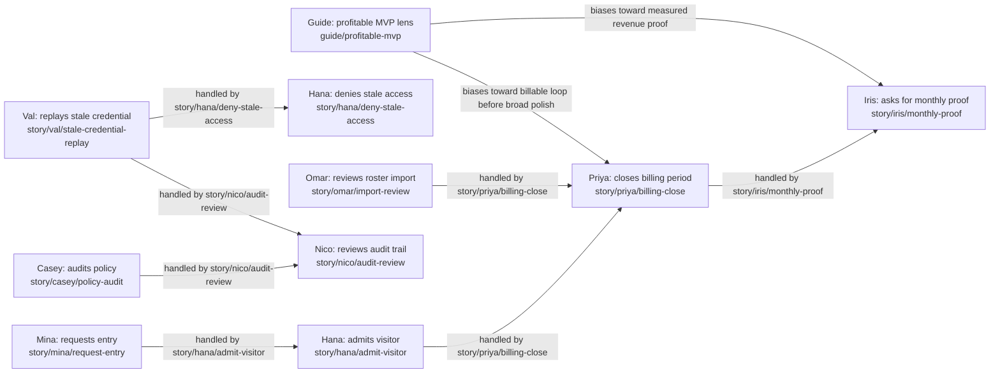

# Seed actor profiles template

Use this as the first draft for a project-owned actor profile doc such as `docs/design/seed-actor-profiles.md`. Replace the AccessLoop examples with the project's seeded users, personas, stakeholders, antagonists, and optional guiding figures. See `docs/design/actor-driven-development.md` for the full process.

## Seed coverage contract

Every seeded user-like record, demo persona, E2E actor, role fixture, or synthetic account must have a profile before the owning ticket reaches VAL. New seed rows should fail validation until their anchors, display names, story keys, and cross-actor edges are represented here.

When this profile set becomes more than a short design note, generate or maintain an app-readable graph under `docs/design/actors/`: one Markdown file per actor/story, typed `edges.jsonl`, generated `index.json`, and `actor-graph.json`. The generic profile server described in `docs/design/profile-server-app.md` should load that corpus directly.

## Source inventory

| Source | Actors covered |
|--------|----------------|
| `backend/.../seed.*` | Mina Vale, Omar Reyes, Hana Cho, Priya Shah, Nico Brooks |
| `frontend/.../fixtures.*` | Member previews, operator previews, story scenario metadata |
| `tests/e2e/...` | Arrival, denial, billing close, audit, and antagonist flows |

## Outside-force and guiding-figure inventory

| Actor or figure | Class | Force / principle | Related roled actors |
|-----------------|-------|-------------------|----------------------|
| Iris Chen | Stakeholder / investor | Requires aggregate proof of usage, billing, and growth readiness | Priya, Nico, Omar |
| Casey Ward | Stakeholder / compliance | Requires safe, auditable policy behavior | Hana, Nico, Mina |
| Val Cross | Antagonist | Attempts stale credential replay and social-pressure exceptions | Hana, Nico |
| Profitable MVP Lens | Optional guiding figure | Biases toward the smallest trustworthy paid-usage proof loop | Mina, Hana, Priya, Iris |

Guiding figures are optional. Instantiate one only when the team wants a durable decision lens; otherwise leave this row as a suggestion and let stakeholders remain ordinary outside-force actors.

## Actor story relationship graph

## Story-edge table

| Origin story | Affected actor | Handler story | Coverage note |
|--------------|----------------|---------------|---------------|
| `story/mina/request-entry` | Hana Cho | `story/hana/admit-visitor` | Member arrival creates host/operator work. |
| `story/hana/admit-visitor` | Priya Shah | `story/priya/billing-close` | Visit activity must become billing/settlement evidence. |
| `story/omar/import-review` | Priya Shah | `story/priya/billing-close` | Roster state changes affect active billing counts. |
| `story/priya/billing-close` | Iris Chen | `story/iris/monthly-proof` | Financial close produces stakeholder proof. |
| `story/casey/policy-audit` | Nico Brooks | `story/nico/audit-review` | Compliance pressure needs admin reconstruction. |
| `story/val/stale-credential-replay` | Hana Cho | `story/hana/deny-stale-access` | Antagonist attempts need safe denial. |
| `story/val/stale-credential-replay` | Nico Brooks | `story/nico/audit-review` | Security attempts need audit visibility. |
| `guide/profitable-mvp` | Priya Shah | `story/priya/billing-close` | Guiding figure biases early work toward paid-usage proof. |

If the handler story cell would be blank, create the handler story. If no existing actor can own it, allocate a new role, stakeholder, antagonist, or guiding figure and add enough personas to cover meaningful choices or failure modes.

## Profile: Mina Vale

**Seed anchors:** `local-member`, `user_member_mina`, `member_mina`

**Role:** Direct user / member.

**Personality:** Decisive, schedule-driven, and irritated by vague arrival instructions.

**Job and life context:** Uses partner locations while moving between meetings. She values predictable access, clear eligibility, and privacy.

**Routine:** Searches the night before, requests entry near arrival, checks visit history when usage or billing feels surprising.

| Story key | Trigger | Expected flow | UI surfaces | Backend/data surfaces | Time and persistence |
|-----------|---------|---------------|-------------|-----------------------|----------------------|
| `story/mina/request-entry` | Needs a workspace near a meeting | Finds a location, confirms eligibility, requests entry | Member directory, office detail, entry panel | Offices, eligibility, access grant | Search state may persist in URL; entry grant has a short TTL |
| `story/mina/usage-review` | Monthly allowance looks low | Reviews visits without seeing internal finance | Member usage panel | Usage ledger, visit history | Annual allowance and paid bundle balances persist |

**Security boundaries:** Mina never sees raw credentials after issuance, provider secrets, unrelated member data, or admin-only audit details.

**Test duties:** E2E member search, request-entry, usage history, and denial copy.

**Growth-dream candidates:** Pre-arrival readiness that warns about hours, eligibility, and entry mode before she reaches the door.

## Profile: Omar Reyes

**Seed anchors:** `local-operator`, `user_operator_omar`

**Role:** Direct user / office operator.

**Personality:** Methodical and spreadsheet-literate, but impatient with cleanup work caused by vague import errors.

**Job and life context:** Keeps roster data accurate so members can use services and finance can bill correctly.

**Routine:** Reviews new imports weekly, fixes blocked rows, checks active/inactive counts before billing close.

| Story key | Trigger | Expected flow | UI surfaces | Backend/data surfaces | Time and persistence |
|-----------|---------|---------------|-------------|-----------------------|----------------------|
| `story/omar/import-review` | New roster upload | Reviews accepted and blocked rows, fixes errors, confirms scope | Operator import review | Import batch, member records, audit | Import rows persist until accepted, rejected, or corrected |
| `story/omar/scoped-reporting` | Needs local roster status | Views only allowed office data | Operator reports | Members, visits, billing summaries | Report periods align to business calendar |

**Security boundaries:** Omar cannot see unrelated offices, privileged billing settings, raw credentials, or admin-only audit details.

**Test duties:** Import validation, office-scope RBAC, formula-neutralized values, and reporting windows.

**Growth-dream candidates:** Guided import repair that explains each blocked row and suggests the smallest safe correction.

## Profile: Hana Cho

**Seed anchors:** `local-host`, `user_host_hana`

**Role:** Direct user / host operator.

**Personality:** Calm under a lobby queue and fond of short, exact admit/deny language.

**Job and life context:** Handles real-time access decisions where safety, hospitality, and speed collide.

**Routine:** Scans arrivals during peaks, admits eligible members, denies stale or ineligible attempts, opens issues when provider state is unclear.

| Story key | Trigger | Expected flow | UI surfaces | Backend/data surfaces | Time and persistence |
|-----------|---------|---------------|-------------|-----------------------|----------------------|
| `story/hana/admit-visitor` | Valid member arrives | Confirms eligibility and admits without extra private data | Host check-in | Credential verify, visit, check-in | Same-day visit state prevents duplicate confusion |
| `story/hana/deny-stale-access` | Stale credential appears | Denies safely and records minimal evidence | Host denial, issue notes | Credential verify, denial event, audit | Denial persists with timestamp and masked identifiers |

**Security boundaries:** Hana sees only minimum data needed at the desk and never sees raw provider secrets, payment data, or privileged admin internals.

**Test duties:** Admit, deny, duplicate, provider fallback, and generic denial copy.

**Growth-dream candidates:** Queue mode that compresses admit/deny/fallback choices into a faster host surface.

## Profile: Priya Shah

**Seed anchors:** `local-finance`, `user_finance_priya`

**Role:** Direct user / finance admin.

**Personality:** Exacting and deadline-aware; she trusts reconciled numbers more than screenshots.

**Job and life context:** Closes billing periods, settlement runs, exports, and financial proof needed by stakeholders.

**Routine:** Reviews usage near month end, runs billing close, validates settlement, exports aggregate proof, investigates anomalies.

| Story key | Trigger | Expected flow | UI surfaces | Backend/data surfaces | Time and persistence |
|-----------|---------|---------------|-------------|-----------------------|----------------------|
| `story/priya/billing-close` | Billing period ends | Reviews counts, excludes ineligible records, exports evidence | Billing workspace, export action | Billing period, usage ledger, settlement | Billing periods are durable and auditable |
| `story/priya/csv-safety` | Needs an export | Exports formula-neutralized CSV | Billing export | Export serializer | Export contents are generated from settled period state |

**Security boundaries:** Priya does not bypass MFA/session policy and never exports secrets, raw credentials, or provider refs.

**Test duties:** Billing inclusion/exclusion, CSV safety, settlement evidence, and MFA-gated finance actions.

**Growth-dream candidates:** One-click period close that bundles anomalies, settlements, and stakeholder proof.

## Profile: Nico Brooks

**Seed anchors:** `local-admin`, `user_admin_nico`

**Role:** Direct user / network admin.

**Personality:** Systems-minded, skeptical of vague support claims, and careful with privileged power.

**Job and life context:** Owns support, rollout, provider reconciliation, audit review, and readiness decisions.

**Routine:** Reviews support issues, checks provider status, approves rollout changes, reconstructs audit events when disputes happen.

| Story key | Trigger | Expected flow | UI surfaces | Backend/data surfaces | Time and persistence |
|-----------|---------|---------------|-------------|-----------------------|----------------------|
| `story/nico/audit-review` | Dispute or security issue | Reconstructs masked event sequence | Admin audit/search | Audit log, visits, incidents | Audit entries are append-only |
| `story/nico/readiness-check` | Launch or investor update | Reviews launch readiness and unresolved blockers | Admin readiness | Offices, provider state, billing, incidents | Readiness snapshots can be compared over time |

**Security boundaries:** Nico must satisfy privileged session/MFA rules and cannot expose raw credentials or secrets to support surfaces.

**Test duties:** Privileged RBAC, MFA denial, masked search, audit reconstruction, readiness metrics.

**Growth-dream candidates:** Readiness command center that links blocker stories to the actors who must handle them.

## Profile: Iris Chen

**Seed anchors:** `force/investor-iris`, `stakeholder/investor`

**Role:** Stakeholder / investor force, not a normal logged-in user.

**Personality:** Numbers-first and patient only when proof is defensible.

**Job and life context:** Applies pressure for evidence that the product can become a trustworthy business.

**Routine:** Monthly proof requests: usage, billing, readiness, growth, anomalies, and runway risk.

| Story key | Trigger | Expected flow | UI surfaces | Backend/data surfaces | Time and persistence |
|-----------|---------|---------------|-------------|-----------------------|----------------------|
| `story/iris/monthly-proof` | Monthly update | Team produces aggregate proof without raw member data | Admin readiness, billing exports | Reports, billing, audit summaries | Period snapshots preserve evidence |

**Security boundaries:** Iris does not receive raw member data, payment details, credentials, secrets, or admin access by default.

**Test duties:** Aggregate reporting, privacy-preserving exports, and proof packet integrity.

**Growth-dream candidates:** Board-ready proof packet generated from existing evidence.

## Profile: Casey Ward

**Seed anchors:** `force/compliance-casey`, `stakeholder/compliance`

**Role:** Stakeholder / compliance force.

**Personality:** Practical, safety-focused, and unimpressed by convenience that weakens policy.

**Job and life context:** Represents policy constraints, incident review, auditability, and safe operational language.

**Routine:** Reviews disputed arrivals and policy exceptions after incidents or procedural changes.

| Story key | Trigger | Expected flow | UI surfaces | Backend/data surfaces | Time and persistence |
|-----------|---------|---------------|-------------|-----------------------|----------------------|
| `story/casey/policy-audit` | Access decision is challenged | Admin reconstructs what policy and instructions were active | Audit/search, host issue detail | Policy config, audit events, incidents | Policy changes are timestamped |

**Security boundaries:** Casey's pressure cannot justify exposing raw credentials, secrets, or unrelated personal data.

**Test duties:** Policy audit trail, manual fallback evidence, denial reconstruction.

**Growth-dream candidates:** Policy replay for disputed arrivals.

## Profile: Val Cross

**Seed anchors:** `antagonist/stale-access-val`, `adversary/credential-replay`

**Role:** Antagonist / stale-access opportunist.

**Personality:** Patient, socially smooth, and drawn to ambiguous edge cases.

**Job and life context:** Represents abuse pressure on stale credentials, weak denial wording, and privileged shortcut routes.

**Routine:** Replays old screenshots, pressures busy hosts, probes under-protected admin surfaces after access changes.

| Story key | Trigger | Expected flow | UI surfaces | Backend/data surfaces | Time and persistence |
|-----------|---------|---------------|-------------|-----------------------|----------------------|
| `story/val/stale-credential-replay` | Old credential is presented | Host denies safely and admin can audit the event | Host denial, admin audit | Credential verify, denial event, audit | Revocation and denial timestamps persist |

**Security boundaries:** Val never receives actionable eligibility detail, raw credentials, member contact data, provider refs, or privileged payloads.

**Test duties:** Negative E2E/security tests, stale credential replay, generic denial copy, audit preservation.

**Growth-dream candidates:** Recurring abuse rehearsal whenever credentials, host flows, or privileged routes change.

## Guiding figure: Profitable MVP Lens

**Anchor:** `guide/profitable-mvp`

**Principle lens:** Fastest trustworthy evidence that the product can create paid value.

**Decision bias:** Prefer the smallest end-to-end loop that proves real usage, safe access, billing, and stakeholder evidence before broadening polish or secondary features.

**Affected actors:** Mina, Hana, Priya, Iris, Nico.

**Story pressure:** Highlights missing edges between usage, billing close, investor proof, and admin readiness.

**Guardrails:** Does not override privacy, security, compliance, user safety, written design authority, or the need for actual evidence.

Delete this guiding figure section if the project does not want an explicit profitable-MVP lens yet. A stakeholder/investor actor may be enough.
