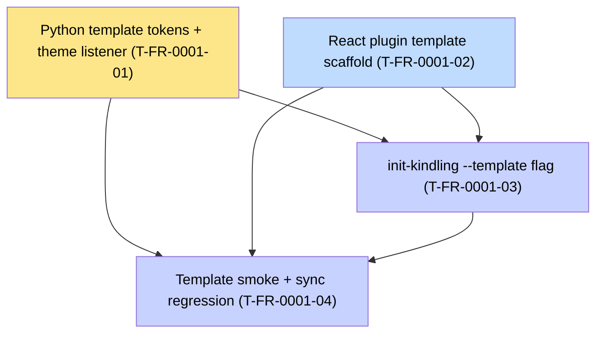

# FR-0001 — Tickets DAG (draft)

Canonical bodies in [`tickets.md`](tickets.md).

## Ticket table

| Id | Title | Type | Deps | Order | Summary |
|----|-------|------|------|-------|---------|
| T-FR-0001-01 | Python template tokens + meta + theme listener | impl | none | P0 | Replace `templates/plugin-python/web/dist/index.html` with the Mantle-aligned shape. DF-T1. |
| T-FR-0001-02 | React plugin template scaffold | impl | none (cross-repo: hearth T-FR-0006-15 for runtime publish) | P1 | New `templates/plugin-react/` with `@kindling/mantle` pinned (workspace ref until hearth publish). RW-T1. |
| T-FR-0001-03 | `init-kindling --template` flag | impl | 01, 02 | P2 | Wire CLI choice between python/react templates. |
| T-FR-0001-04 | Template smoke + sync-kindling regression | impl | 01, 02, 03 | P2 | Add a smoke test that both templates pass `kindling validate` and produce a runnable bundle. |

## Mermaid DAG

## Cross-repo dependency

- **T-FR-0001-02** uses `@kindling/mantle`. Until **hearth T-FR-0006-15** publishes v0.1.0 to npm, the template pins a `workspace:*` or pre-release path in its `package.json`. Switch to the published version in the same commit that closes the dep.

## Parallel waves

| Wave | Tickets |
|------|---------|
| W0 | T01, T02 |
| W1 | T03 |
| W2 | T04 |
